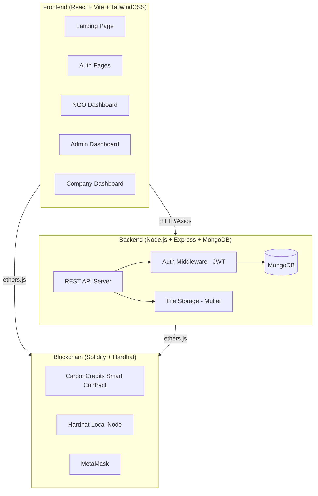
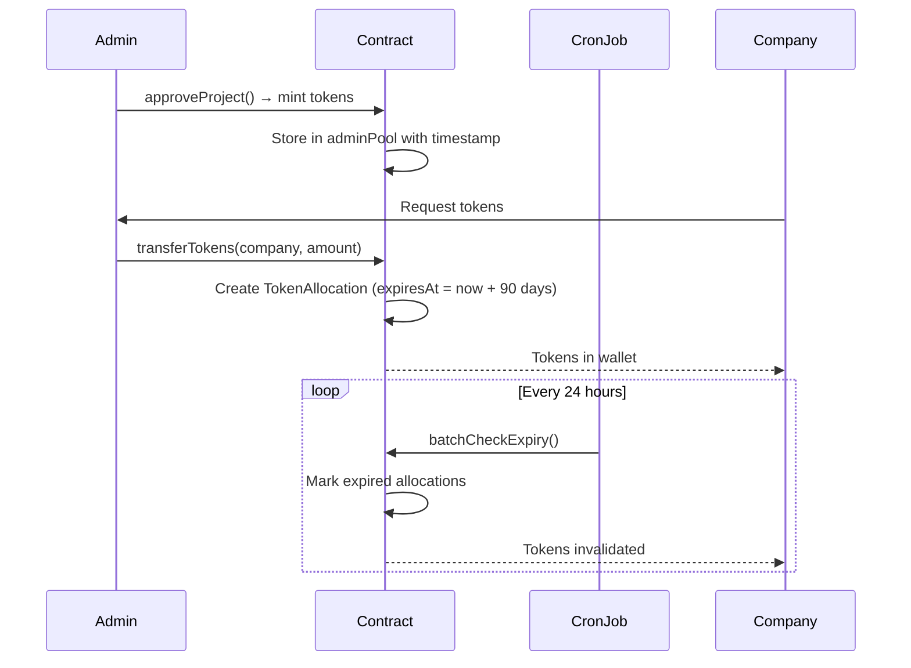
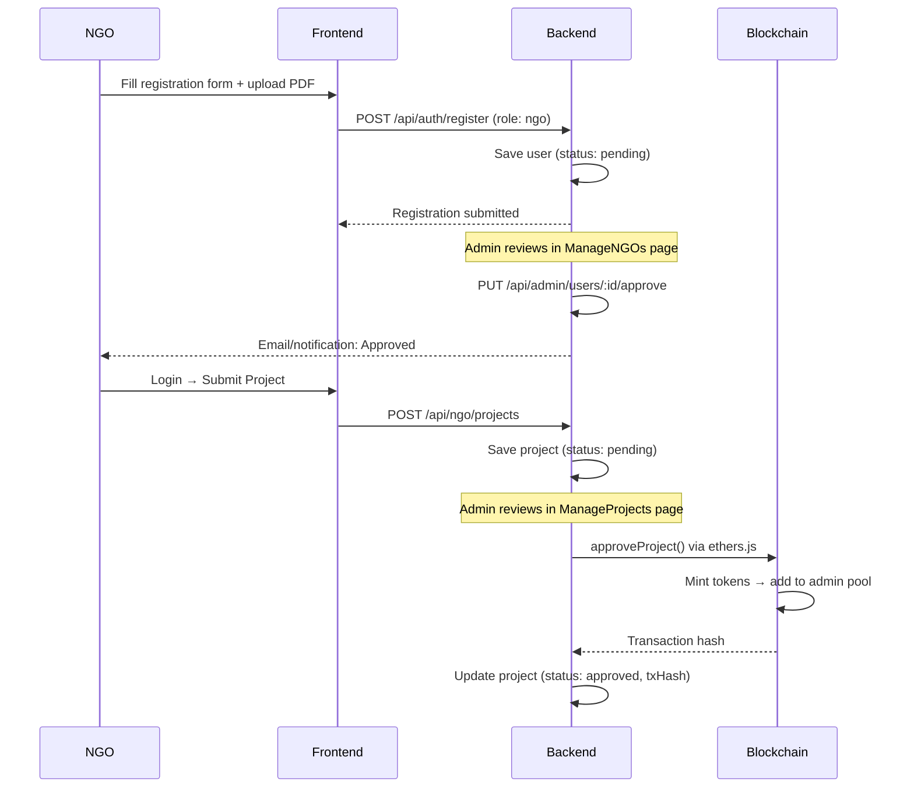
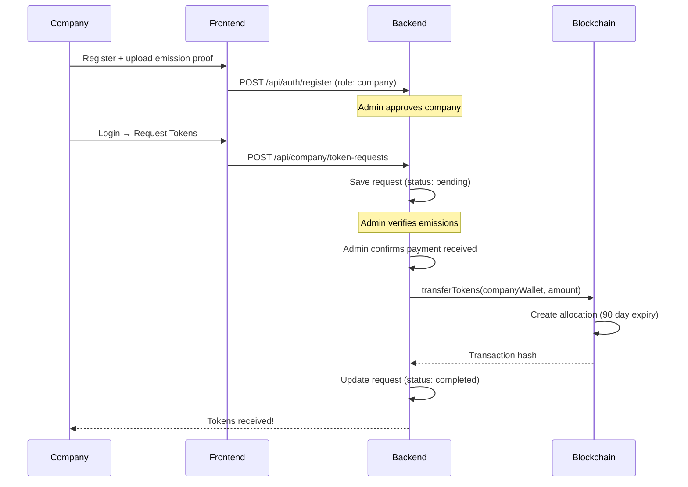

# 🌿 Blue Carbon Credit Registry & MRV System — Implementation Plan

## Overview

Build a **production-grade, blockchain-powered carbon credit platform** with three user roles (NGO, Admin, Company), smart contract-based token minting with **3-month expiry**, and a premium dark-mode UI. The new project will be built in `BLUE_CARBON_CREDIT/` as a clean monorepo, migrating and significantly expanding the existing SIH PROJECT foundation.

---

## User Review Required

> [!IMPORTANT]
> **Database Choice**: The plan uses **MongoDB** (via Mongoose) for persistence. The existing SIH project uses in-memory arrays. If you prefer a different database (PostgreSQL, SQLite), let me know.

> [!IMPORTANT]  
> **Blockchain Network**: The plan targets **Hardhat local network** for development. For production/demo, we can add Sepolia/Mumbai testnet config. Confirm if you want testnet deployment included.

> [!WARNING]
> **MetaMask Required**: Both Admin and the system need MetaMask wallets. The Admin wallet will be the contract deployer. Companies will need MetaMask to receive tokens.

> [!IMPORTANT]
> **Payment Integration**: The spec says payment is "off-chain". This plan implements a manual payment confirmation flow (Admin marks payment as received). If you want Razorpay/Stripe integration, let me know.

---

## Architecture



---

## Project Structure

```
BLUE_CARBON_CREDIT/
├── frontend/                    # React + Vite + TailwindCSS
│   ├── public/
│   ├── src/
│   │   ├── assets/              # Images, icons, fonts
│   │   ├── components/
│   │   │   ├── common/          # Shared UI components
│   │   │   │   ├── Navbar.jsx
│   │   │   │   ├── Sidebar.jsx
│   │   │   │   ├── Footer.jsx
│   │   │   │   ├── LoadingSpinner.jsx
│   │   │   │   ├── StatusBadge.jsx
│   │   │   │   ├── FileUpload.jsx
│   │   │   │   ├── Modal.jsx
│   │   │   │   ├── StatsCard.jsx
│   │   │   │   └── WalletButton.jsx
│   │   │   ├── auth/
│   │   │   │   ├── LoginPage.jsx
│   │   │   │   ├── RegisterNGO.jsx
│   │   │   │   └── RegisterCompany.jsx
│   │   │   ├── landing/
│   │   │   │   └── LandingPage.jsx
│   │   │   ├── ngo/
│   │   │   │   ├── NGODashboard.jsx
│   │   │   │   ├── SubmitProject.jsx
│   │   │   │   ├── MyProjects.jsx
│   │   │   │   └── ProjectDetails.jsx
│   │   │   ├── admin/
│   │   │   │   ├── AdminDashboard.jsx
│   │   │   │   ├── ManageNGOs.jsx
│   │   │   │   ├── ManageCompanies.jsx
│   │   │   │   ├── ManageProjects.jsx
│   │   │   │   ├── TokenRequests.jsx
│   │   │   │   ├── MintTokens.jsx
│   │   │   │   └── BlockchainLogs.jsx
│   │   │   └── company/
│   │   │       ├── CompanyDashboard.jsx
│   │   │       ├── RequestTokens.jsx
│   │   │       ├── MyCredits.jsx
│   │   │       └── PurchaseHistory.jsx
│   │   ├── context/
│   │   │   ├── AuthContext.jsx
│   │   │   └── Web3Context.jsx
│   │   ├── hooks/
│   │   │   ├── useAuth.js
│   │   │   ├── useWeb3.js
│   │   │   └── useContract.js
│   │   ├── services/
│   │   │   ├── api.js           # Axios instance
│   │   │   ├── authService.js
│   │   │   ├── projectService.js
│   │   │   ├── tokenService.js
│   │   │   └── contractService.js
│   │   ├── utils/
│   │   │   ├── constants.js
│   │   │   ├── helpers.js
│   │   │   └── contractABI.js
│   │   ├── App.jsx
│   │   ├── main.jsx
│   │   └── index.css
│   ├── index.html
│   ├── vite.config.js
│   ├── tailwind.config.js
│   ├── postcss.config.js
│   └── package.json
│
├── backend/                     # Node.js + Express + MongoDB
│   ├── config/
│   │   └── db.js
│   ├── middleware/
│   │   ├── auth.js              # JWT verification
│   │   ├── upload.js            # Multer config
│   │   └── roleCheck.js         # Role-based access
│   ├── models/
│   │   ├── User.js
│   │   ├── Project.js
│   │   ├── TokenRequest.js
│   │   └── Transaction.js
│   ├── routes/
│   │   ├── auth.js
│   │   ├── ngo.js
│   │   ├── admin.js
│   │   ├── company.js
│   │   ├── projects.js
│   │   └── tokens.js
│   ├── controllers/
│   │   ├── authController.js
│   │   ├── ngoController.js
│   │   ├── adminController.js
│   │   ├── companyController.js
│   │   ├── projectController.js
│   │   └── tokenController.js
│   ├── services/
│   │   └── blockchainService.js # Server-side ethers.js
│   ├── uploads/                 # PDF/image storage
│   ├── server.js
│   ├── seed.js                  # Seed admin account
│   ├── .env.example
│   └── package.json
│
├── blockchain/                  # Solidity + Hardhat
│   ├── contracts/
│   │   └── BlueCarbonCredit.sol # Enhanced smart contract
│   ├── scripts/
│   │   └── deploy.js
│   ├── test/
│   │   └── BlueCarbonCredit.test.js
│   ├── hardhat.config.cjs
│   └── package.json
│
├── .gitignore
└── README.md
```

---

## Proposed Changes

### 1. Blockchain Layer — Smart Contract

#### [NEW] `blockchain/contracts/BlueCarbonCredit.sol`

Enhanced Solidity contract with the following additions over the existing `CarbonCredits.sol`:

| Feature | Existing | New |
|---------|----------|-----|
| Token Expiry (90 days) | ❌ | ✅ |
| Company wallet tracking | ❌ | ✅ |
| Token transfer to companies | ❌ | ✅ |
| Admin pool management | ❌ | ✅ |
| Expiry check & invalidation | ❌ | ✅ |
| Token request/approval flow | ❌ | ✅ |
| Event logging for transfers | Basic | Comprehensive |

Key additions:
```solidity
struct TokenAllocation {
    uint256 amount;
    uint256 mintedAt;
    uint256 expiresAt;      // mintedAt + 90 days
    bool expired;
    address holder;          // company or admin pool
    uint256 projectId;
}

// New functions:
function transferTokens(address company, uint256 amount) external onlyAdmin;
function checkExpiry(uint256 allocationId) external;
function batchCheckExpiry() external;
function getCompanyTokens(address company) external view;
function getAdminPoolBalance() external view;
```

#### [NEW] `blockchain/scripts/deploy.js`
#### [NEW] `blockchain/test/BlueCarbonCredit.test.js`
#### [NEW] `blockchain/hardhat.config.cjs`
#### [NEW] `blockchain/package.json`

---

### 2. Backend Layer — API Server

#### [NEW] `backend/models/User.js`

```javascript
// Schema:
{
  name: String,
  email: { type: String, unique: true },
  password: String,                    // bcrypt hashed
  role: { enum: ['ngo', 'company', 'admin'] },
  status: { enum: ['pending', 'approved', 'rejected'] },
  walletAddress: String,               // MetaMask address
  // NGO fields
  organisationName: String,
  registrationNumber: String,
  registrationCertificate: String,     // file path
  // Company fields
  companyName: String,
  annualEmissions: Number,             // tonnes CO2
  emissionProof: String,               // PDF path
  createdAt: Date,
  approvedAt: Date
}
```

#### [NEW] `backend/models/Project.js`

```javascript
{
  title: String,
  ngoId: ObjectId,                     // ref: User
  projectType: { enum: ['mangrove', 'forest', 'wetland', 'seagrass'] },
  location: { lat: Number, lng: Number, address: String },
  area: Number,                        // hectares
  carbonCapture: Number,               // tonnes/year
  description: String,
  photos: [String],                    // file paths
  forestDetails: String,
  status: { enum: ['pending', 'verified', 'approved', 'rejected'] },
  blockchainTxHash: String,
  contractProjectId: Number,           // on-chain ID
  tokensMinted: Number,
  adminNotes: String,
  createdAt: Date,
  verifiedAt: Date,
  approvedAt: Date
}
```

#### [NEW] `backend/models/TokenRequest.js`

```javascript
{
  companyId: ObjectId,                 // ref: User
  requestedAmount: Number,             // tokens
  basedOnEmissions: Number,            // tonnes CO2
  emissionProofDoc: String,            // PDF
  status: { enum: ['pending', 'approved', 'payment_pending', 'completed', 'rejected'] },
  paymentConfirmed: Boolean,
  blockchainTxHash: String,
  tokenAllocationId: Number,           // on-chain
  expiresAt: Date,
  createdAt: Date
}
```

#### [NEW] `backend/models/Transaction.js`

```javascript
{
  type: { enum: ['mint', 'transfer', 'expire'] },
  fromAddress: String,
  toAddress: String,
  amount: Number,
  projectId: ObjectId,
  txHash: String,
  blockNumber: Number,
  timestamp: Date
}
```

#### API Routes Summary

| Method | Endpoint | Role | Description |
|--------|----------|------|-------------|
| `POST` | `/api/auth/register` | Public | Register NGO/Company (status: pending) |
| `POST` | `/api/auth/login` | Public | JWT login |
| `GET` | `/api/auth/me` | All | Get current user profile |
| `POST` | `/api/files/upload` | All | Upload PDF/images |
| `GET` | `/api/ngo/projects` | NGO | Get own projects |
| `POST` | `/api/ngo/projects` | NGO | Submit new project |
| `GET` | `/api/admin/users` | Admin | List all users by role/status |
| `PUT` | `/api/admin/users/:id/approve` | Admin | Approve NGO/Company |
| `PUT` | `/api/admin/users/:id/reject` | Admin | Reject NGO/Company |
| `GET` | `/api/admin/projects` | Admin | All projects |
| `PUT` | `/api/admin/projects/:id/verify` | Admin | Verify project data |
| `PUT` | `/api/admin/projects/:id/approve` | Admin | Approve + trigger blockchain |
| `PUT` | `/api/admin/projects/:id/reject` | Admin | Reject project |
| `POST` | `/api/admin/tokens/mint` | Admin | Mint tokens on-chain |
| `GET` | `/api/admin/token-requests` | Admin | View token requests |
| `PUT` | `/api/admin/token-requests/:id/approve` | Admin | Approve + transfer tokens |
| `GET` | `/api/company/dashboard` | Company | Total credits summary |
| `POST` | `/api/company/token-requests` | Company | Request tokens |
| `GET` | `/api/company/credits` | Company | View owned credits |
| `GET` | `/api/company/purchase-history` | Company | Purchase history |
| `GET` | `/api/transactions` | All | Blockchain transaction log |
| `GET` | `/api/stats` | Public | Platform statistics |

#### [NEW] Backend Dependencies

```json
{
  "express": "^4.18.2",
  "cors": "^2.8.5",
  "mongoose": "^8.0.0",
  "bcryptjs": "^2.4.3",
  "jsonwebtoken": "^9.0.2",
  "multer": "^1.4.5-lts.1",
  "dotenv": "^16.3.1",
  "ethers": "^6.8.1",
  "node-cron": "^3.0.3",
  "nodemon": "^3.0.1"
}
```

---

### 3. Frontend Layer — React Application

#### Design System

- **Theme**: Premium dark mode with glassmorphism
- **Primary palette**: Deep ocean teal (`#0d9488` → `#14b8a6`) with blue accents
- **Font**: Inter (Google Fonts)
- **Animations**: Framer Motion for page transitions and micro-interactions
- **Charts**: Recharts for carbon analytics
- **Icons**: Lucide React

#### Key Pages & Components

##### Landing Page (`LandingPage.jsx`)
- Hero section with animated carbon metrics counter
- "How It Works" 4-step visual flow  
- Impact statistics (total CO2 captured, projects funded, etc.)
- CTA buttons for NGO/Company registration

##### Auth Pages
- **LoginPage.jsx** — Role selector (NGO / Company / Admin), JWT auth
- **RegisterNGO.jsx** — Multi-step form: Organization details → Document upload (PDF) → Wallet connect → Submit for approval
- **RegisterCompany.jsx** — Company details → Emission proof upload → Wallet connect → Submit for approval

##### NGO Dashboard
- **NGODashboard.jsx** — Overview: project count, status breakdown, notifications
- **SubmitProject.jsx** — Form: photos (drag-drop), location (map picker or lat/lng), area, forest type, carbon estimate, description
- **MyProjects.jsx** — Table of submitted projects with status badges (Pending/Verified/Approved/Rejected)
- **ProjectDetails.jsx** — Full project view + blockchain transaction hash link

##### Admin Dashboard
- **AdminDashboard.jsx** — Master stats: total NGOs, companies, projects, tokens minted, pool balance
- **ManageNGOs.jsx** — List NGO registrations, view documents, approve/reject
- **ManageCompanies.jsx** — List company registrations, view emission proofs, approve/reject
- **ManageProjects.jsx** — View project submissions, verify data, approve (triggers smart contract)
- **TokenRequests.jsx** — View company token requests, verify emissions, approve/reject
- **MintTokens.jsx** — Mint tokens for approved projects (MetaMask transaction)
- **BlockchainLogs.jsx** — Real-time transaction history from smart contract events

##### Company Dashboard
- **CompanyDashboard.jsx** — Total credits owned (not project-wise), expiry countdown, carbon offset summary
- **RequestTokens.jsx** — Form: emission amount, proof document upload, token amount calculation
- **MyCredits.jsx** — Owned token allocations with expiry dates and status
- **PurchaseHistory.jsx** — Past purchases and transactions

##### Common Components
- **Navbar.jsx** — Top bar with user info, notifications, logout
- **Sidebar.jsx** — Role-based navigation menu
- **StatsCard.jsx** — Glassmorphic stat cards with gradient borders
- **StatusBadge.jsx** — Color-coded status indicators
- **FileUpload.jsx** — Drag-and-drop with preview
- **Modal.jsx** — Confirmation dialogs for approvals/rejections
- **WalletButton.jsx** — MetaMask connect/disconnect
- **LoadingSpinner.jsx** — Branded loading animation

##### Context & Hooks
- **AuthContext.jsx** — JWT token management, user state, role-based redirects
- **Web3Context.jsx** — MetaMask connection, network detection, account tracking
- **useAuth.js** — Hook for auth operations
- **useWeb3.js** — Hook for wallet & contract interactions
- **useContract.js** — Hook for reading/writing smart contract

#### Frontend Dependencies

```json
{
  "react": "^18.2.0",
  "react-dom": "^18.2.0",
  "react-router-dom": "^6.8.1",
  "axios": "^1.6.2",
  "ethers": "^6.8.1",
  "framer-motion": "^10.16.0",
  "recharts": "^2.10.0",
  "lucide-react": "^0.294.0",
  "react-hot-toast": "^2.4.1",
  "react-dropzone": "^14.2.3"
}
```

---

### 4. Token Expiry System (Unique Feature)



- **On-chain**: `expiresAt` timestamp stored per allocation; `checkExpiry()` marks them invalid
- **Off-chain**: `node-cron` job runs every 24h to call `batchCheckExpiry()`
- **Frontend**: Real-time countdown timer on Company dashboard

---

### 5. Complete Workflow Implementation

#### NGO Registration → Project Approval Flow



#### Company Token Purchase Flow



---

## Execution Order

The implementation will follow this order to ensure each layer builds upon tested foundations:

| Phase | Component | Details | Est. Files |
|-------|-----------|---------|------------|
| **1** | Project Setup | Monorepo scaffolding, configs, .gitignore | 8 |
| **2** | Blockchain | Smart contract, deploy script, tests | 4 |
| **3** | Backend Core | Models, auth middleware, seed script | 10 |
| **4** | Backend Routes | All API endpoints + controllers | 12 |
| **5** | Frontend Core | Vite setup, design system (CSS), contexts | 8 |
| **6** | Landing + Auth | Landing page, Login, Register pages | 4 |
| **7** | NGO Dashboard | All NGO pages + project submission | 4 |
| **8** | Admin Dashboard | All admin management pages | 7 |
| **9** | Company Dashboard | Company pages + token request flow | 4 |
| **10** | Integration | End-to-end wiring, cron jobs, polish | 5 |

**Total: ~66 files, estimated execution time: 2-3 hours of building**

---

## Open Questions

> [!IMPORTANT]
> **1. MongoDB Setup**: Do you have MongoDB installed locally, or should I use MongoDB Atlas (cloud) connection string? Alternatively, I can use a simpler file-based DB like LowDB/NeDB for easier setup.

> [!IMPORTANT]  
> **2. Email Notifications**: Should approved/rejected users receive email notifications, or is in-app notification sufficient for now?

> [!NOTE]
> **3. Map Integration**: For project location in the NGO submission form, should I integrate Google Maps / Leaflet for a visual map picker, or is a simple lat/lng text input sufficient?

> [!NOTE]
> **4. Existing SIH Project**: Should I build entirely fresh in `BLUE_CARBON_CREDIT/`, or copy and enhance the existing code from `SIH PROJECT`? The plan assumes fresh build with design inspiration from the existing code.

---

## Verification Plan

### Automated Tests
- `npx hardhat test` — Smart contract unit tests (minting, expiry, transfers)
- Backend API testing via manual curl/Postman commands
- Frontend smoke test via `npm run build` (no compile errors)

### Manual Verification
1. **Start Hardhat node** → Deploy contract → Verify address
2. **Start backend** → Seed admin account → Verify API health check
3. **Start frontend** → Test complete flows:
   - NGO registration → Admin approval → Project submission → Admin verification → Token minting
   - Company registration → Admin approval → Token request → Payment confirmation → Token transfer
   - Token expiry verification (accelerated for testing)
4. **Browser recording** of the complete end-to-end flow
